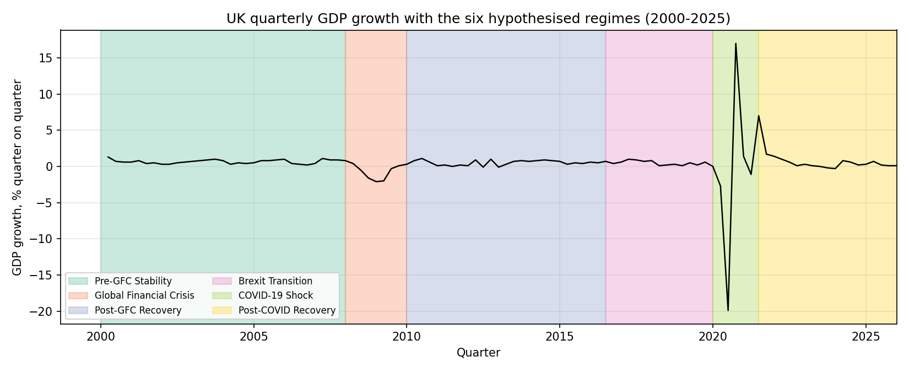
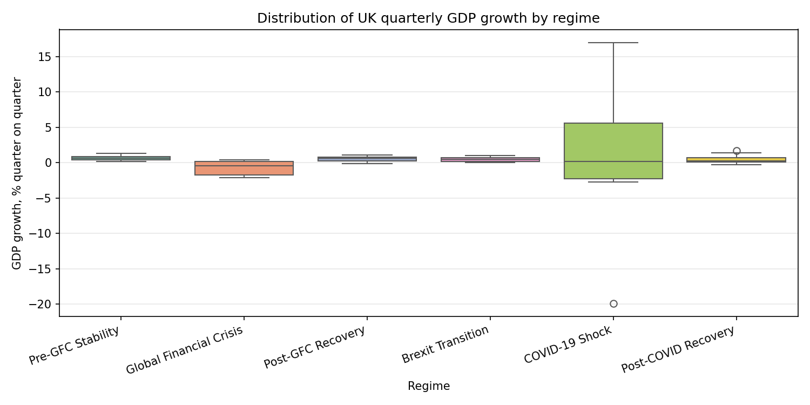
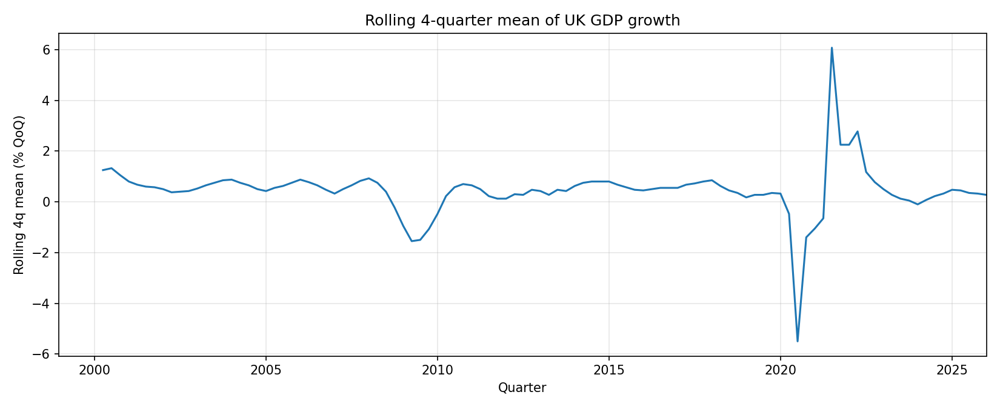
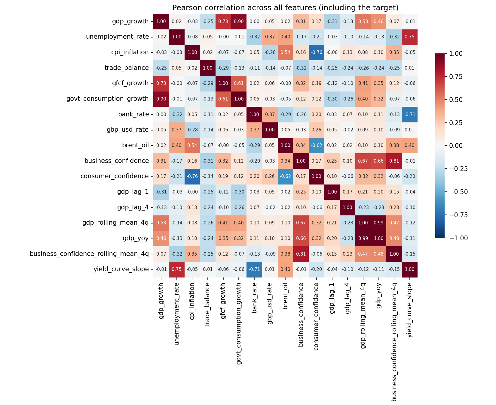

# Exploratory data analysis: UK quarterly GDP, 2000-2025

This page describes what the final modelling dataset looks like before any
formal structural-break tests are run. The point of the EDA is to see the
data clearly and to flag candidate points where the level or volatility of
GDP growth appears to change.

It does **not** claim that any regime boundary is statistically confirmed.
The Chow tests and the Bai-Perron sensitivity sweep that come next in the
sprint are what will formally accept or reject each boundary.

Dataset: `data/processed/final_dataset.parquet` (104 quarters, 18 columns,
2000 Q1 - 2025 Q4). Target: `gdp_growth` (% quarter on quarter). Regime
periods used for shading and grouping below come from `config/regimes.yaml`.

## Figure 1: GDP growth over time, with the six regime bands

Quarterly UK GDP growth over the sample period is shown with six hypothesised regimes indicated by shaded bands. Growth remains within a relatively narrow range for most of the sample, typically between -1% and +1.5% quarter-on-quarter. 

Two episodes deviate substantially from this pattern. During the global financial crisis, GDP contracted steadily, reaching approximately -2% in 2008–2009. The COVID-19 shock generated a much larger disruption, with GDP declining by approximately -20% in 2020 Q2, followed by an increase of approximately +17% in the subsequent quarter.

 The differing dynamics of these episodes (a prolonged contraction during the global financial crisis and a sharp contraction followed by rapid growth during COVID-19) suggest the presence of distinct economic regimes. 
 
 The shaded intervals represent economically motivated breakpoints associated with the global financial crisis, the 2016 EU referendum, and the COVID-19 pandemic. These classifications are evaluated formally using structural break tests in subsequent analysis.

## Figure 2: Distribution of GDP growth by regime

Figure 2 presents the distribution of quarterly GDP growth across regimes. The pre-global financial crisis, post-global financial crisis, Brexit, and post-COVID regimes exhibit similar distributions, characterised by relatively low dispersion and median growth rates slightly above zero. In contrast, the crisis regimes display distinct characteristics. 

The global financial crisis regime is centred marginally below zero with moderate dispersion, whereas the COVID-19 regime exhibits substantially greater variability, reflecting the extreme contraction and subsequent recovery observed in 2020.

 The evidence suggests that differences across regimes arise from both changes in average growth and changes in volatility, with the COVID-19 period primarily distinguished by elevated variance. Interpretation of the crisis-period distributions should recognise the limited number of observations available within these regimes.

## Figure 3: Rolling 4-quarter mean of GDP growth

Figure 3 reports the four-quarter rolling mean of GDP growth. The smoothed series highlights three broad phases: a sustained decline during 2008–2009, a relatively stable period centred around 0.5% growth between 2010 and 2019, and a pronounced decline followed by recovery during the COVID-19 period. 

The series is derived from the engineered gdp_rolling_mean_4q variable and spans the full sample from 2000 Q1. These movements are consistent with potential shifts in the underlying growth process and provide descriptive evidence for subsequent structural break testing.

## Figure 4: Pearson correlation heatmap

Figure 4 presents the Pearson correlation matrix for all variables. The strongest correlations with GDP growth are observed for government consumption growth (0.90) and gross fixed capital formation growth (0.73). 

Given that both variables are expenditure components of GDP, these relationships largely reflect accounting identities rather than independent predictive content. Most macroeconomic and financial indicators, including unemployment, inflation, the policy interest rate, the exchange rate, oil prices, and confidence measures, exhibit weak to moderate correlations with GDP growth. 

Engineered GDP features display moderate correlations by construction (gdp_rolling_mean_4q = 0.53; gdp_yoy = 0.46), while lagged GDP terms are comparatively weakly associated with the target. The matrix also reveals substantial collinearity among several predictors, including gdp_rolling_mean_4q and gdp_yoy (0.99), business confidence and its rolling mean (0.81), and the yield-curve slope with both the policy rate (-0.71) and unemployment (0.75). These relationships are relevant for subsequent model estimation and interpretation.

## Summary statistics for `gdp_growth` by regime

| regime | count | mean | std | min | max | skewness | kurtosis |
| --- | --- | --- | --- | --- | --- | --- | --- |
| Pre-GFC Stability | 32 | 0.656 | 0.272 | 0.200 | 1.300 | 0.260 | -0.590 |
| Global Financial Crisis | 8 | -0.713 | 1.036 | -2.100 | 0.400 | -0.424 | -1.883 |
| Post-GFC Recovery | 26 | 0.519 | 0.348 | -0.100 | 1.100 | -0.330 | -0.983 |
| Brexit Transition | 14 | 0.457 | 0.320 | 0.000 | 1.000 | 0.226 | -1.180 |
| COVID-19 Shock | 6 | 0.283 | 12.198 | -19.900 | 17.000 | -0.541 | 1.533 |
| Post-COVID Recovery | 18 | 0.428 | 0.533 | -0.300 | 1.700 | 1.033 | 0.705 |

Means and spreads vary visibly across regimes. The small GFC and COVID samples make any moment estimate noisy; the project uses bootstrap intervals for per-regime claims in the SHAP analysis later.

## Overall `describe()` for every column

| column | count | mean | std | min | 25% | 50% | 75% | max |
| --- | --- | --- | --- | --- | --- | --- | --- | --- |
| gdp_growth | 104.000 | 0.429 | 2.744 | -19.900 | 0.200 | 0.500 | 0.800 | 17.000 |
| unemployment_rate | 104.000 | 5.415 | 1.328 | 3.700 | 4.400 | 5.100 | 5.742 | 8.400 |
| cpi_inflation | 104.000 | 2.561 | 2.061 | 0.000 | 1.392 | 2.100 | 3.033 | 10.767 |
| trade_balance | 104.000 | -1948.157 | 1978.433 | -8465.000 | -2623.250 | -2137.667 | -1541.750 | 7463.000 |
| gfcf_growth | 104.000 | 0.652 | 3.611 | -17.965 | -0.878 | 0.649 | 2.771 | 16.379 |
| govt_consumption_growth | 104.000 | 0.531 | 2.866 | -17.932 | -0.196 | 0.359 | 1.039 | 17.777 |
| bank_rate | 104.000 | 2.466 | 2.176 | 0.100 | 0.500 | 0.750 | 4.750 | 6.000 |
| gbp_usd_rate | 104.000 | 1.517 | 0.223 | 1.117 | 1.336 | 1.505 | 1.628 | 2.037 |
| brent_oil | 104.000 | 66.815 | 27.930 | 19.395 | 45.306 | 67.465 | 84.180 | 121.204 |
| business_confidence | 104.000 | -5.881 | 11.700 | -44.482 | -12.573 | -5.420 | 1.307 | 24.442 |
| consumer_confidence | 104.000 | -10.494 | 9.216 | -39.000 | -17.083 | -7.700 | -4.525 | 1.767 |
| gdp_lag_1 | 104.000 | 0.443 | 2.746 | -19.900 | 0.200 | 0.500 | 0.800 | 17.000 |
| gdp_lag_4 | 104.000 | 0.461 | 2.748 | -19.900 | 0.200 | 0.500 | 0.800 | 17.000 |
| gdp_rolling_mean_4q | 104.000 | 0.448 | 1.019 | -5.500 | 0.275 | 0.500 | 0.731 | 6.075 |
| gdp_yoy | 104.000 | 1.737 | 4.305 | -21.595 | 1.104 | 2.013 | 2.956 | 25.546 |
| business_confidence_rolling_mean_4q | 104.000 | -5.769 | 10.187 | -33.807 | -12.048 | -6.431 | 0.882 | 20.055 |
| yield_curve_slope | 104.000 | 0.748 | 0.923 | -1.126 | 0.123 | 0.596 | 1.311 | 2.930 |

The descriptive statistics indicate substantial variation in both the scale and dispersion of the variables. GDP growth averages 0.43% per quarter, with a standard deviation of 2.74 percentage points. The minimum (-19.9%) and maximum (17.0%) values reflect the exceptional contraction and subsequent expansion observed during the COVID-19 period. Similar extremes are evident in government consumption growth and gross fixed capital formation growth, suggesting that expenditure components were also heavily affected by major economic shocks.

Macroeconomic indicators exhibit differing degrees of variability. The unemployment rate ranges from 3.7% to 8.4%, while inflation varies between 0.0% and 10.8%, reflecting changing economic conditions across the sample period. Financial variables also display substantial variation, with the Bank Rate ranging from 0.1% to 6.0% and Brent crude oil prices ranging from approximately $19 to $121 per barrel.

The table further highlights the heterogeneous scales of the variables. For example, the Bank Rate is measured in percentage points, Brent oil prices in US dollars per barrel, and the trade balance in monetary units with values several orders of magnitude larger than most other variables. Consequently, variables with larger numerical scales could exert disproportionate influence in regularised machine-learning models. Standardisation is therefore applied prior to model estimation, particularly for Ridge regression, to ensure that coefficient estimation is not driven by differences in measurement scale.

## ADF stationarity tests at the 5% level

| column | adf_stat | p_value | verdict_at_5pct |
| --- | --- | --- | --- |
| gdp_growth | -9.815 | 0.000 | pass |
| unemployment_rate | -1.688 | 0.437 | fail |
| cpi_inflation | -1.884 | 0.340 | fail |
| trade_balance | -7.501 | 0.000 | pass |
| gfcf_growth | -12.276 | 0.000 | pass |
| govt_consumption_growth | -6.026 | 0.000 | pass |
| bank_rate | -2.182 | 0.213 | fail |
| gbp_usd_rate | -1.459 | 0.554 | fail |
| brent_oil | -2.752 | 0.065 | fail |
| business_confidence | -5.234 | 0.000 | pass |
| consumer_confidence | -2.188 | 0.211 | fail |
| gdp_lag_1 | -9.813 | 0.000 | pass |
| gdp_lag_4 | -9.731 | 0.000 | pass |
| gdp_rolling_mean_4q | -4.768 | 0.000 | pass |
| gdp_yoy | -4.747 | 0.000 | pass |
| business_confidence_rolling_mean_4q | -2.568 | 0.100 | fail |
| yield_curve_slope | -2.222 | 0.199 | fail |

ADF stationarity tests (5% significance level). Augmented Dickey–Fuller (ADF) tests are reported to assess the presence of unit roots in each series. The null hypothesis is that the series contains a unit root (i.e., is non-stationary in levels). Rejection of the null at the 5% level is interpreted as evidence of stationarity.

The results indicate that several variables, including GDP growth, trade balance, gross fixed capital formation growth, government consumption growth, and business confidence, reject the unit root null at conventional significance levels. In contrast, unemployment, inflation, the Bank Rate, the exchange rate, and consumer confidence fail to reject the null, suggesting persistence consistent with non-stationarity in levels. Brent crude oil prices are borderline, failing to reject at the 5% level (p = 0.065), although the result is closer to conventional significance thresholds than most other non-rejecting series.

The mixed evidence implies heterogeneity in stochastic properties across variables. This is relevant for model specification, particularly in settings where lag structures and regularisation are used, as non-stationary regressors may affect inference and coefficient stability if not appropriately transformed or controlled for.

## Missing-value counts

No missing observations are present in the final dataset. This reflects the construction procedure, in which lagged and rolling variables are generated prior to the final sample window (2000–2025). As a result, engineered features are computed using pre-sample information rather than imputation or deletion, and the final estimation sample is fully balanced.